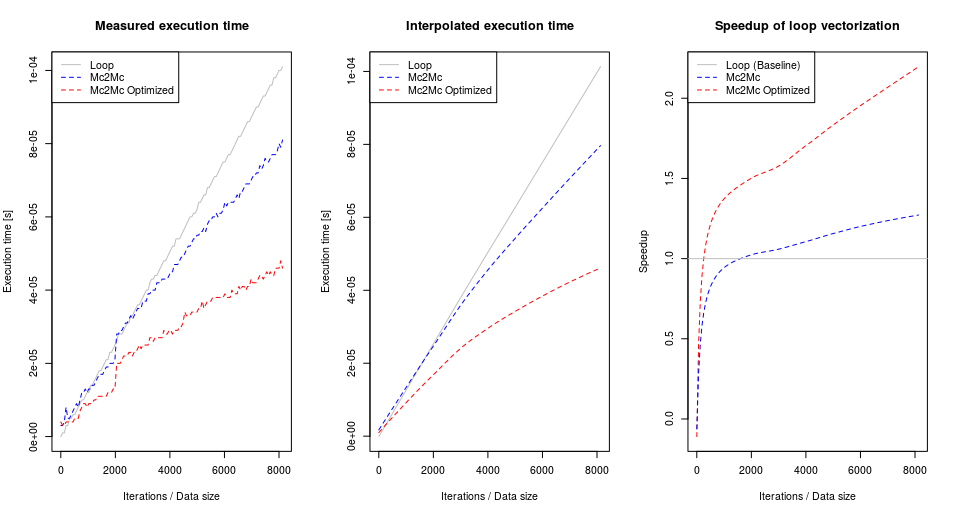

# Profile-based vectorization for MATLAB

Complementary materials, analysis, and codes for a paper "Profile-based Vectorization for MATLAB" by Patryk Kiepas, Jarosław Kożlak, Claude Tadonki, Corinne Ancourt, ARRAY 2018.

An example of loop _nw2_ profiling analysis -- searching for PV points (Profitable Vectorization):

